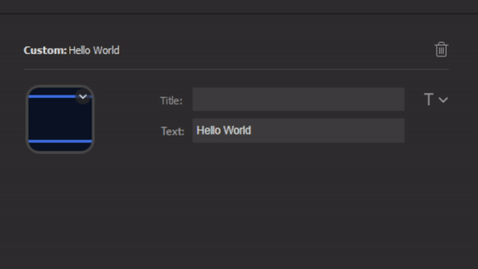

`Hello World` is a sample plugin demonstrating the [Stream Deck SDK](https://developer.elgato.com/documentation/stream-deck/) in C++.

# Description

`Hello World` is a plugin that displays "Hello World" on a key. The message displays one digit at a time using the example Timer. The message is configurable through the Property Inspector.

# Features

- C++ code
- an example tool to repackage and install the plugin
- an example Property Inspector with a demo on saving per-context settings

# Installation

In the Release folder, you can find the file `com.elgato.helloworld.streamDeckPlugin`. If you double-click this file on your machine, Stream Deck will install the plugin.

Also provided is a tool `reload.bat` that will repackage and install the plugin.

# Source code

The Sources folder contains the source code of the plugin.
